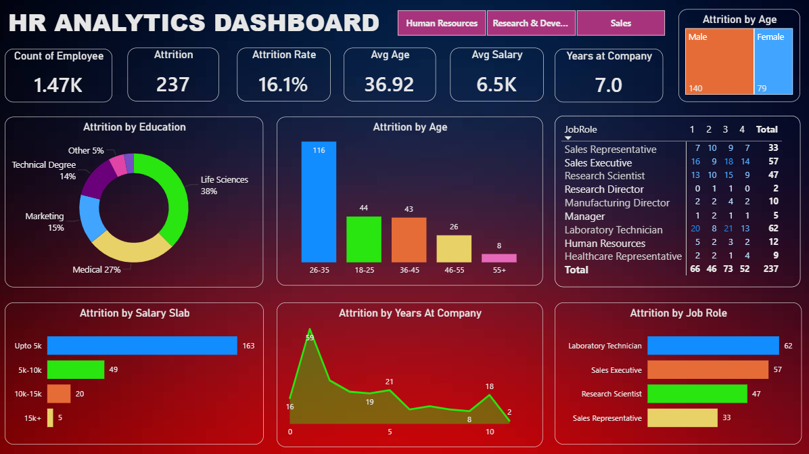

# HR-Analytics-Dashboard-using-Power-BI

1. Project Title / Headline

HR Analytics Dashboard using Power BI

2. Short Description / Purpose

This HR Analytics Dashboard is designed to analyze employee attrition, workforce demographics, salary distribution, and job role performance using Power BI. The dashboard provides interactive visual insights into employee trends, helping HR teams make data-driven decisions related to employee retention, workforce planning, and organizational performance.

3. Tech Stack

Power BI Desktop – Dashboard development and data visualization
Excel / CSV Dataset – Data source
Power Query – Data cleaning and transformation
DAX (Data Analysis Expressions) – KPI calculations and measures
Data Modeling – Relationship management and analytics

4. Features

Interactive HR analytics dashboard
Employee attrition analysis
Attrition rate KPI tracking
Department-wise employee insights
Attrition analysis by age group
Education field attrition distribution
Salary slab analysis
Years at company analysis
Job role-wise attrition tracking
Dynamic filters and slicers
Professional dark-themed dashboard UI

## Dashboard Screenshot

